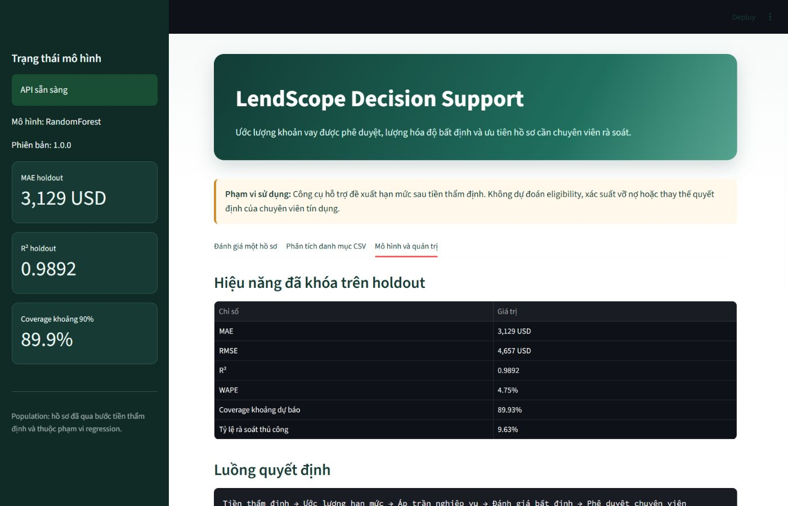
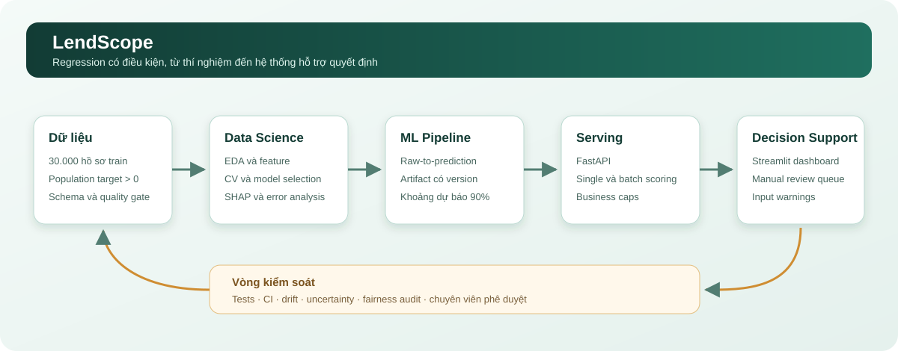

<div align="center">

# LendScope

### Hệ thống hỗ trợ ước lượng hạn mức vay sau tiền thẩm định

[](https://www.python.org/)
[](https://scikit-learn.org/)
[](https://fastapi.tiangolo.com/)
[](https://streamlit.io/)
[](#kiểm-thử-và-tái-lập)

LendScope kết hợp quy trình Data Science có kiểm chứng với pipeline Machine Learning Engineering có thể triển khai: notebook chạy thật, lựa chọn mô hình bằng cross-validation, uncertainty, API, dashboard, test, Docker và CI.

</div>



> LendScope không quyết định khách hàng có được vay hay không. Mô hình chỉ ước lượng số tiền phê duyệt cho population đã qua bước tiền thẩm định và không đo xác suất vỡ nợ.

## Tổng quan kiến trúc



## Bài toán nghiệp vụ

Population huấn luyện chỉ gồm hồ sơ lịch sử có số tiền phê duyệt lớn hơn 0. Mô hình phù hợp với bước sau tiền thẩm định:

1. Hệ thống hoặc chuyên viên xác định hồ sơ đã đủ điều kiện xem xét hạn mức.
2. LendScope ước lượng số tiền phê duyệt theo chính sách lịch sử.
3. Hệ thống áp trần không vượt số tiền yêu cầu và không vượt 80% giá trị tài sản.
4. Hồ sơ có khoảng dự báo tương đối rộng hoặc đầu vào ngoài phân phối được chuyển sang rà soát thủ công.

Không được dùng mô hình này để quyết định eligibility. Các target bằng 0 có thể đại diện cho hồ sơ không được duyệt, nhưng việc loại chúng khỏi regression tạo ra bài toán có điều kiện; nếu muốn xử lý toàn bộ quy trình cần thêm một mô hình classification riêng ở upstream.

## Dashboard hỗ trợ quyết định

Frontend không phải cổng đăng ký vay dành cho khách hàng. Đây là màn hình hỗ trợ analyst và chuyên viên tín dụng với ba luồng:

| Chế độ | Mục đích | Kết quả chính |
|---|---|---|
| Đánh giá một hồ sơ | Demo và rà soát từng trường hợp | Hạn mức, khoảng 90%, tỷ lệ trên request, LTV, cảnh báo |
| Phân tích danh mục CSV | Chấm điểm theo lô và ưu tiên xử lý | KPI danh mục, phân phối hạn mức, manual-review queue, CSV đầu ra |
| Mô hình và quản trị | Minh bạch phạm vi và kiểm soát | Metric holdout, decision flow, giới hạn và vấn đề chất lượng dữ liệu |

Pipeline tự chia CSV thành các request tối đa 1.000 hồ sơ để tuân thủ giới hạn API. Một tệp 20.000 dòng đã được chạy end-to-end thành công.

## Kết quả đã chạy

Dữ liệu train có 30.000 dòng. Sau kiểm tra chất lượng:

- 21.457 hồ sơ có target dương được dùng cho regression.
- 7.865 hồ sơ target bằng 0 không thuộc population của mô hình.
- 338 target âm dạng sentinel `-999` và 340 target thiếu bị loại.
- ID và `Gender` không được dùng làm feature sản xuất; `Gender` chỉ phục vụ audit chênh lệch nhóm trong notebook.

Mô hình được chọn bằng validation rồi xác nhận qua 5-fold cross-validation trên ba ứng viên tốt nhất. Random Forest ổn định hơn ứng viên thắng trên một validation split đơn lẻ và được refit trên train + validation trước khi đánh giá holdout đúng một lần.

| Metric holdout | Kết quả |
|---|---:|
| MAE | 3.128,51 USD |
| RMSE | 4.657,00 USD |
| R² | 0,98923 |
| WAPE | 4,75% |
| Sai số trong ±10% | 95,90% |
| Sai số trong ±20% | 99,72% |
| Bias trung bình | +68,08 USD |
| MAE baseline 70% request | 3.840,11 USD |
| Cải thiện MAE so với baseline | 18,53% |
| Coverage khoảng dự báo 90% | 89,93% |
| Tỷ lệ rà soát thủ công | 9,63% |

Các con số trên được sinh bởi pipeline production tại `outputs/reports`. Notebook 03 và 05 lưu kết quả của lần thí nghiệm độc lập nên có thể chênh nhẹ do thời điểm refit và hậu xử lý.

## Notebook

Các notebook đã được chạy tuần tự, lưu đầy đủ output, nhận xét và kết luận bằng tiếng Việt:

- `01_EDA.ipynb`: định nghĩa đúng population, audit target, missing, sentinel và phân phối nghiệp vụ.
- `02_Feature_Engineering.ipynb`: EDA, quan hệ target, feature engineering và split chống leakage.
- `03_Model_Experiments.ipynb`: baseline, nhiều họ mô hình, validation, cross-validation, MLflow và holdout.
- `04_Model_Interpretation.ipynb`: permutation importance, SHAP, error analysis theo dải target và audit giới tính.
- `05_Business_Report.ipynb`: hậu xử lý, khoảng dự báo, hàng đợi manual review và giới hạn sử dụng.

Một số phát hiện làm thay đổi quy trình trong lúc chạy thật:

- XGBoost tốt nhất trên một validation split nhưng Random Forest có MAE cross-validation thấp và ổn định hơn.
- MLflow bản mới không chấp nhận file backend cũ, nên tracking được chuyển sang SQLite.
- Khoảng dự báo phải hiệu chỉnh bằng validation residual, không dùng holdout residual.
- `data/test.csv` chứa ký hiệu `?` trong hai cột số; pipeline production ép kiểu lỗi thành missing trước imputation.

## Cấu trúc

```text
notebooks/          Phân tích và thí nghiệm đã thực thi
src/                Logic dữ liệu, feature, model, inference và monitoring
tests/              Unit test và integration test
scripts/            CLI validate, train và predict
configs/            Cấu hình nghiệp vụ và thí nghiệm
backend/            FastAPI
frontend/           Streamlit
outputs/            Artifact và báo cáo sinh ra cục bộ
.github/workflows/  CI cho test, lint và Docker build
docs/assets/        Ảnh dashboard và sơ đồ dùng trong tài liệu
```

Tỷ trọng project được thiết kế gần 6/4 giữa Data Scientist và ML Engineer: phần DS tập trung vào population, EDA, baseline, model selection, explainability và error analysis; phần MLE bao gồm pipeline raw-to-prediction, artifact có version, API, giao diện, test, monitoring, Docker và CI.

## Cài đặt và chạy

Yêu cầu Python 3.10 đến 3.14.

```bash
python -m venv .venv
python -m pip install -e ".[api,frontend,notebooks,dev]"
python scripts/validate_data.py
python scripts/train.py
python scripts/predict.py
python -m pytest
```

Chạy API và frontend ở hai terminal:

```bash
uvicorn backend.main:app --reload
streamlit run frontend/app.py
```

Hoặc dùng Docker sau khi đã tạo `outputs/models/lendscope.joblib`:

```bash
docker compose up --build
```

- API docs: `http://localhost:8000/docs`
- Frontend: `http://localhost:8501`

Ví dụ payload API:

```json
{
  "records": [
    {
      "Age": 35,
      "Income (USD)": 4500,
      "Income Stability": "High",
      "Profession": "Working",
      "Type of Employment": "Managers",
      "Location": "Urban",
      "Loan Amount Request (USD)": 100000,
      "Current Loan Expenses (USD)": 500,
      "Expense Type 1": "Y",
      "Expense Type 2": "N",
      "Dependents": 1,
      "Credit Score": 760,
      "No. of Defaults": 0,
      "Has Active Credit Card": "Active",
      "Property Age": 12,
      "Property Type": 2,
      "Property Location": "Urban",
      "Co-Applicant": 1,
      "Property Price": 180000
    }
  ]
}
```

## Artifact và monitoring

Artifact `lendscope.joblib` chứa toàn bộ feature engineering, imputation, encoding, model, version, checksum dữ liệu, reference statistics, kết quả lựa chọn mô hình và ngưỡng uncertainty. Vì vậy CLI, API và frontend không cần tái tạo preprocessing riêng.

Mỗi dự báo trả về:

- dự báo điểm và khoảng dự báo 90%;
- cờ `manual_review` dựa trên độ rộng khoảng dự báo đã hiệu chỉnh từ validation;
- `input_warning` khi giá trị nằm ngoài p01-p99 hoặc category chưa từng thấy;
- phiên bản mô hình để truy vết.

## Kiểm thử và tái lập

```bash
python -m pytest
python -m ruff check src backend frontend scripts tests --select E9,F63,F7,F82
docker compose config --quiet
```

Trạng thái kiểm tra gần nhất:

- 16 test unit/integration đã qua.
- 5 notebook thực thi đủ cell và không có output lỗi.
- Package cài editable thành công và `pip check` không phát hiện dependency hỏng.
- Batch inference hoàn tất trên 20.000 hồ sơ test.

## Giới hạn quan trọng

- Target phản ánh quyết định lịch sử, không phải “khả năng trả nợ tối ưu”; mô hình có thể học lại chính sách và thiên lệch lịch sử.
- Dataset không có nhãn default/loss nên không thể khẳng định hạn mức đề xuất an toàn về rủi ro tín dụng.
- Quan hệ giữa request và target rất mạnh, đồng thời target tập trung ở một số tỷ lệ chính sách. Hiệu năng cao cần được diễn giải trong bối cảnh này, không xem là bằng chứng tổng quát hóa sang ngân hàng hoặc thời kỳ khác.
- Audit giới tính trong notebook chỉ là kiểm tra ban đầu, chưa thay thế đánh giá fairness theo quy định và chưa chứng minh công bằng nhân quả.
- Trước production thật cần backtest theo thời gian, champion-challenger, phê duyệt risk/compliance, xác thực dữ liệu đầu vào và giám sát drift/performance khi target thực tế quay về.
